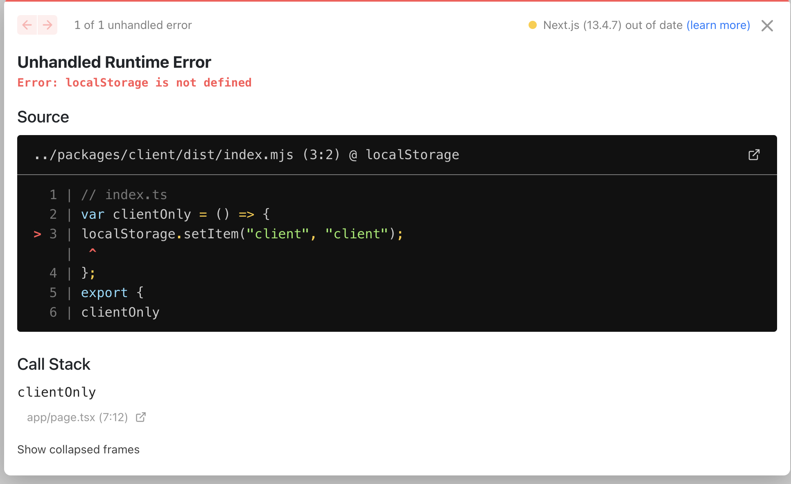

# Make your React library RSC compatible
This guide is intended for library authors or maintainers who wish to make their libraries RSC compatible. **It's incomplete now and will be updated as i learn more.**

## The problem

React now has different types of component which has different APIs available to them.

* **Recat Server Component (RSC)** 
React Server Component is a new feature introduced in React 18. It allows developers to write React components which **can only be rendered on the server**. It can't use any client-side hooks (useState, etc) and Web APIs. It can use Node.js APIs or Web Platform APIs.

* **Client Component**
Client Component is the component we used to familiar with.It has client-side interactivity and can use client-side hooks (useState, useRef, etc) and Web APIs.

If your library uses client-side hooks (useState, etc) or Web APIs but users accidentally run it in RSC, it will cause runtime errors.

The error message is confused for users who are not familiar with RSC since they would assume the `localStorage` should always be available.

### Marker packages - `client-only` and `server-only`

## References
* [directives](https://react.dev/reference/react/directives)
* [react essentials](https://nextjs.org/docs/getting-started/react-essentials)
* [server-module-conventions](https://github.com/reactjs/rfcs/blob/main/text/0227-server-module-conventions.md)

