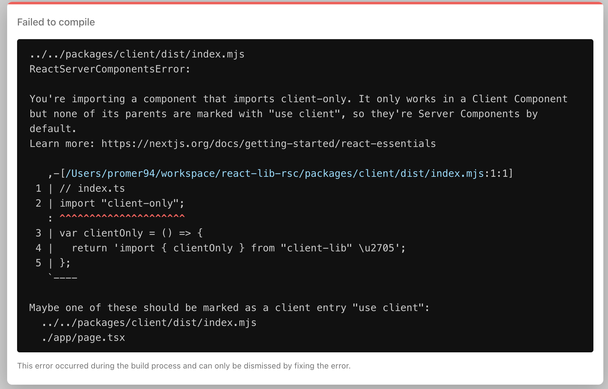

# Make your React library RSC compatible
This guide is intended for library authors or maintainers who wish to make their libraries RSC compatible. **It's incomplete now and will be updated as i learn more.**

## Your library might be used in wrong environment

React now has different types of component which has different runtime APIs available to them.

* **Recat Server Component (RSC)** 
is a new feature introduced in React 18. It allows developers to write React components which can only be rendered on the server. **It can't use any client-side hooks (useState, etc) and Web APIs**. It can use Node.js APIs or Web Platform APIs.

* **Client Component** is the component we used to familiar with.It has client-side interactivity and can use client-side hooks (useState, useRef, etc) and Web APIs.

So conceptually, a React Application will have two separate bundles - RSC bundle and client bundle. The RSC bundle will be only be executed on the server. The client bundle is primarily rendered on the client side but could also be used for pre-rendering (SSR, SSG, ISR).


if users try to use your library as they used to do, it probably will cause a runtime error because your library will be packed into the RSC bundle by default.


```jsx
import clientOnly from 'client-lib'

clientOnly()

function ServerComponent() {
  return <div>Server Component</div>;
}
```


To fix this error, user need to use the new directive **`'use client'`**. This directive will define a boundary between RSC and client component. Once **`'use client'`** is defined in a file, all other modules imported into it, including child components, are considered part of the **client bundle**.

```jsx
'use client';
// Web APIs and client-side hooks would be available now
import clientOnly from 'client-lib';

clientOnly();

function ClientComponent() {
  return <div>Client Component</div>;
}
```  
### Marker Packages

The error message above is not informative enough for users to come up the correct solution. Instead, it will probably confuse users who are not familiar with RSC since they would assume `localStorge` should always be available. As a library author, you could improve this by using marker packages provided by React.

* **client-only** is a marker package that indicates that the package is only intended to be used in client components. You can import it at the top of your library's entry to provide informative error messages to users when they try to use your library in RSC.



* **server-only** is a marker package that indicates that the package is only intended to be used in RSC. You can import it at the top of your library's entry to provide informative error messages to users when they try to use your library in client components.


## References
* [directives](https://react.dev/reference/react/directives)
* [react essentials](https://nextjs.org/docs/getting-started/react-essentials)
* [server-module-conventions](https://github.com/reactjs/rfcs/blob/main/text/0227-server-module-conventions.md)

